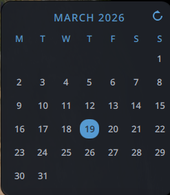

# Calendar Widget

A compact, theme aware Noctalia desktop widget that displays the current month.

## Features
- **Day Highlight**

## Configuration
**First Day of Week**: Toggle between Sunday or Monday start.

## Requirements
- **Noctalia Shell**: 3.6.0 or later.
- **Fonts**: Requires a monospace or icon-compatible font for proper alignment.

## Technical Details
- **Backend**: QML integration with shell-based data collection.
